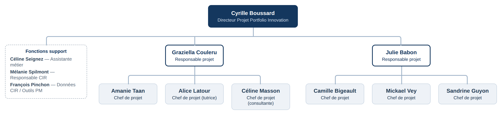

# II — L'organisation de mon service : la Direction Projet Innovation

L'innovation fait intervenir de nombreux métiers et expertises au sein de
l'entreprise. Elle constitue d'ailleurs l'une des grandes activités des
Laboratoires Théa, aux côtés du life cycle management, des projets structurants ou
encore de l'IT. Pendant mon stage, j'étais rattachée à la Direction Projet
Innovation, l'équipe chargée de piloter les projets d'innovation.

C'est une petite équipe, d'une douzaine de personnes, ce qui a un vrai avantage :
l'information circule vite et on peut échanger facilement, sans passer par toute
une hiérarchie.

L'équipe s'organise sur trois niveaux : une direction, deux responsables projet
qui encadrent chacune un groupe de chefs de projet, et les chefs de projet
eux-mêmes. À cela s'ajoutent quelques fonctions support rattachées directement à
la direction (Figure 2).

## À la tête du service : le Directeur Projet Portfolio Innovation

Cyrille Boussard dirige la Direction Projet Innovation. Son poste s'intitule
exactement « Directeur Projet Portfolio Innovation ». Ce n'est pas seulement un
rôle de manager : c'est une fonction de direction, dont la responsabilité dépasse
le suivi d'un projet en particulier.

Sa mission a deux volets. Le premier est l'innovation : repérer les opportunités,
mettre en relation les bonnes personnes et faire le lien entre les équipes
internes et les partenaires extérieurs pour faire avancer les nouveaux projets. Le
second est le « portfolio », c'est-à-dire l'ensemble des projets menés en
parallèle par l'équipe, suivis dans leur globalité plutôt qu'un par un. C'est lui
qui garde cette vue d'ensemble : il arbitre les priorités, répartit les moyens
entre les projets et veille à ce que tout reste cohérent avec la stratégie de
l'entreprise. C'est cette dimension de pilotage global qui fait la différence avec
un simple rôle d'encadrement, et c'est ce que recouvre le mot « portfolio » dans
son intitulé.

Il faut d'ailleurs distinguer deux choses. Le service, lui, s'appelle la Direction
Projet Innovation ; c'est à lui que j'étais rattachée, comme le reste de l'équipe.
Le « portfolio », en revanche, ne concerne que le poste de Cyrille Boussard : il
renvoie à sa mission de pilotage global du portefeuille de projets, et non au nom
d'un service à part.

Autour de la direction interviennent plusieurs fonctions support : une assistante
métier, ainsi que des fonctions liées au CIR (Crédit d'Impôt Recherche) et aux
outils de gestion de projet. Elles interviennent de façon transversale, en appui
de toute l'équipe.

## Le niveau intermédiaire : les responsables projet

Sous la direction, deux responsables projet encadrent chacune un groupe de chefs
de projet : Graziella Couleru et Julie Babon. Elles font le relais entre la
direction et les chefs de projet, suivent l'avancement des projets de leur groupe
et accompagnent les chefs de projet au quotidien.

Leur rôle ne s'arrête pas au suivi des projets : elles assurent aussi un
accompagnement plus humain. Ce sont elles qui définissent les attendus des chefs
de projet sur l'année, qui les encadrent au jour le jour et qui interviennent en
cas de litige ou de tension au sein du service. Un point mérite d'être souligné :
ces responsables sont elles-mêmes chefs de projet et pilotent, en parallèle de
l'encadrement de leur groupe, leurs propres projets, comme les autres membres de
l'équipe.

## Les chefs de projet

Viennent enfin les chefs de projet, qui font concrètement avancer les projets au
quotidien. Leur métier ayant été au cœur de mon stage, je le détaille dans la
partie suivante.
