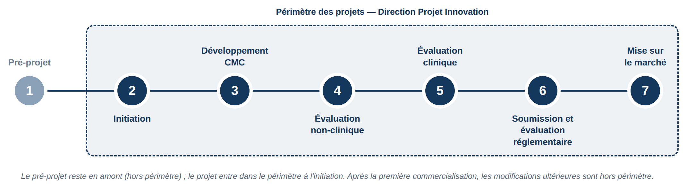

# IV — Le cycle de vie d'un produit de santé et le périmètre des projets

Comprendre le cycle de vie d'un médicament aide à situer le travail des équipes
projets. Je le présente ici dans son ensemble, avant de préciser quelles étapes
entrent réellement dans le périmètre des projets suivis par la Direction Projet
Innovation. Ce cycle est un processus long et très encadré, qui va de la première
idée jusqu'à la mise sur le marché.

## 1 — L'idée de projet (pré-projet)

Tout commence par une idée, ou une opportunité thérapeutique, qui fait l'objet
d'une première réflexion sur son intérêt scientifique, médical et stratégique.
C'est une phase encore exploratoire, en amont du projet, où l'on cherche surtout à
savoir si l'idée mérite d'être développée.

## 2 — L'initiation

L'initiation intervient bien après l'idée. Une fois l'idée retenue, le projet est
officiellement lancé : une décision formelle valide ce lancement et engage les
ressources nécessaires. C'est à ce moment que le projet prend forme et que les
bases du parcours à venir sont posées.

## 3 — Le développement CMC

Le développement CMC (Chimie, Fabrication et Contrôles) définit et stabilise les
aspects industriels du produit : son procédé de fabrication et les méthodes qui
garantissent sa qualité et sa reproductibilité dans le temps. Chez Théa, il
n'inclut pas la formulation. Ce travail démarre tôt et se poursuit en parallèle
des étapes suivantes.

## 4 — L'évaluation non-clinique

Avant le moindre essai chez l'humain, le produit est étudié en dehors de tout
contexte humain. On évalue son profil de façon globale : notamment sa toxicité et
sa pharmacocinétique — la façon dont l'organisme l'absorbe, le distribue et
l'élimine — ainsi que son efficacité et sa sécurité. Ces premières données sont
indispensables avant de passer à l'humain.

## 5 — L'évaluation clinique

C'est l'étape des essais menés chez l'humain, de manière progressive et très
encadrée. Elle se déroule classiquement en plusieurs phases (I, II et III), sur
des groupes de plus en plus larges. Elles permettent de vérifier la sécurité du
produit, de déterminer la posologie optimale et de confirmer son rapport
bénéfice/risque. C'est une phase déterminante, longue et strictement encadrée sur
les plans méthodologique et éthique.

## 6 — La soumission et l'évaluation réglementaire

Le laboratoire constitue un dossier complet, qu'il dépose auprès des autorités
compétentes dans les différents pays visés. Celles-ci l'examinent en vue de
délivrer l'autorisation de mise sur le marché (AMM), sans laquelle le produit ne
peut pas être commercialisé.

## 7 — La mise sur le marché

Une fois l'autorisation obtenue, le produit devient accessible aux professionnels
de santé et aux patients. Il reste ensuite surveillé grâce à la pharmacovigilance,
qui veille à sa sécurité et à son bon usage dans la durée.

## Le périmètre des projets à la Direction Projet Innovation

Tous les projets ne couvrent pas l'intégralité de ce cycle. La phase d'idée, tout
en amont, n'est pas gérée par la Direction Projet Innovation : le projet n'entre
dans le périmètre de l'équipe qu'au moment de l'initiation. C'est à cette étape
que les chefs de projet reçoivent leurs premières tâches, et une partie de ces
tâches découle directement des phases amont, même si l'équipe ne pilote pas ces
phases elle-même. À l'autre extrémité du cycle, le suivi s'arrête à la première
mise sur le marché : les modifications apportées au produit par la suite ne sont
pas gérées dans ce cadre. Le périmètre des projets s'étend donc, pour l'essentiel,
de l'initiation à la première commercialisation, comme le montre la figure
ci-dessus.
